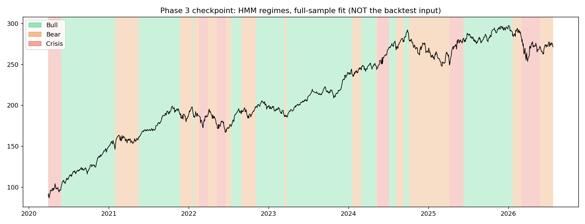
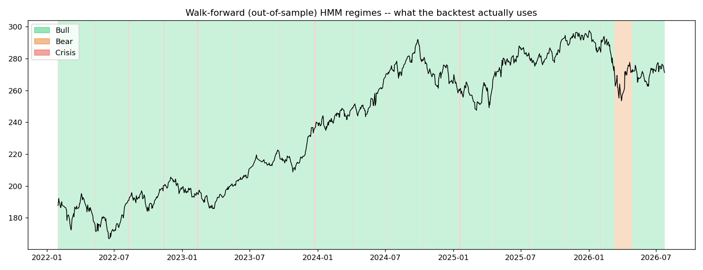
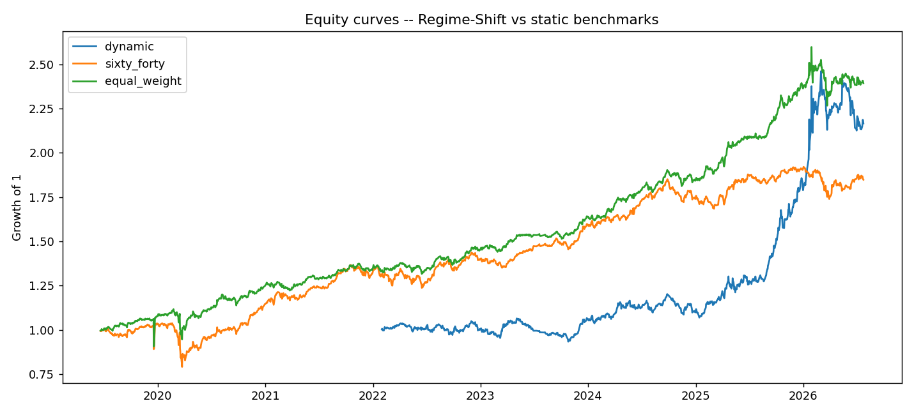

# Regime-Shift: Macro-Aware Tactical Asset Allocation Engine

Detects the market regime (Bull / Bear / Crisis) from an HMM fit on Indian-market
data, and dynamically reallocates a 3-asset portfolio (equity / bonds / gold) to
match, validated with walk-forward testing so the model never sees the future.

## Results

| Strategy | Ann. Return | Ann. Vol | Sharpe | Sortino | Max DD | Calmar |
|---|---|---|---|---|---|---|
| **Regime-Shift (dynamic)** | 19.8% | 16.9% | **1.17** | **1.55** | **-13.6%** | **1.46** |
| Static 60/40 | 10.1% | 13.6% | 0.74 | 0.84 | -23.8% | 0.42 |
| Equal-Weight | 13.9% | 13.0% | 1.07 | 1.18 | -15.3% | 0.91 |

1,689 trading days (2019-06-21 to 2026-07-24), 17 walk-forward folds, 1,059
out-of-sample days. Full numbers: `results_summary.csv`. Reasoning behind
every design choice that produced this: see **Key decisions** below.

## Pipeline

`data.py` → `features.py` → `regime.py` → `validation.py` → `portfolio.py` → `backtest.py`,
orchestrated end-to-end by `main.py`.

## Key decisions

**Assets: NIFTYBEES.NS / LTGILTBEES.NS / GOLDBEES.NS + ^INDIAVIX (feature only).**
Equity and gold were easy picks (most liquid, longest-history ETFs on NSE). Bonds
were the real choice: went with a pure sovereign long-gilt ETF (8-13yr duration)
over Bharat Bond ETFs (AAA corporate, but duration shrinks as the fixed target
maturity approaches, inconsistent rate sensitivity across an 8-year backtest)
and over a liquid/overnight ETF (near-zero duration, too flat to behave like a
bond leg at all).

**3 regimes, not more.** Matches the brief directly (Bull/Bear/Crisis), and it's
also the practical ceiling for how many states hmmlearn's `covariance_type="diag"`
Gaussian HMM can reliably separate given roughly a decade of daily data and a
genuinely rare Crisis class, more states risks splitting noise rather than
finding real structure.

**3 features feed the HMM, not all ~20 Phase-2 candidates:** equity 21d realized
vol, equity 21d momentum, India VIX level. Deliberately lean, the other
momentum/vol windows are collinear with these (same asset, overlapping lookback),
which destabilizes a diag-covariance HMM fit, and per-asset vol for bonds/gold
adds dimensions without adding regime-discriminating signal. Market regime is
overwhelmingly an equity-driven, VIX-confirmed phenomenon.

**Best-of-10 random restarts when fitting the HMM, not a single fit.** Found this
the hard way while testing on synthetic data: one arbitrary `random_state`
converged to a degenerate local optimum where two states landed on nearly
identical means (effectively 2 real clusters, not 3). Fitting multiple random
inits and keeping the highest-log-likelihood model is the standard fix for
EM-based models, confirmed robust across 5 different synthetic datasets
afterward.

**Two different z-scoring schemes, on purpose.** `regime.py`'s Phase-3 checkpoint
fit (its `__main__` block) uses one continuous expanding z-score (mean/std at
time `t` uses all data up to `t`), fine for a quick full-sample sanity check.
`validation.py`'s actual
walk-forward loop uses a *different*, stricter scheme: flat mean/std computed
from *only* that fold's training slice, applied fixed to both that fold's train
and test data, the direct analogue of `sklearn`'s `scaler.fit(train)` /
`.transform(test)`. The backtest only ever consumes the walk-forward version.

**Log returns for features, simple returns for the portfolio math.** Log returns
compound additively across time (right for HMM features). But a portfolio's log
return isn't the weighted sum of its assets' log returns, only simple returns
aggregate linearly across assets, so `backtest.py` converts back to simple
returns before any weighting, mu/cov estimation, or equity-curve math.

**Rebalancing rule: on regime change, not on a fixed schedule.** Directly
implements the brief's own warning that "frequent regime flips can quietly
destroy returns once costs are included", that's only a real risk if regime
flips actually *trigger* rebalances, which they do here (confirmed with a test:
a regime series that flips every single day generates >5x the turnover of one
that holds each regime for a stretch, on identical underlying returns).

**Regime-conditional objectives: mean-variance utility (Bull/Bear), pure
min-variance (Crisis).** True Sharpe-ratio maximization is a ratio, not directly
expressible as a convex QP. Mean-variance utility (`maximize μᵀw − λ·wᵀΣw`) is the
standard convex stand-in, a lower λ in calmer regimes has the same practical
effect of leaning harder into the return term. Crisis drops the return term
entirely and minimizes variance only, matching the brief's literal wording.

**Long-only, fully invested, no leverage.** A discretionary choice (matches
holding 3 plain ETFs with no margin/derivatives), not a project requirement.

**Static 60/40 benchmark = 60% equity / 40% bonds, 0% gold, monthly rebalanced.**
"60/40" has one conventional meaning in finance (equity/bonds) even though our
universe has 3 assets, gold is deliberately left out of this specific
benchmark so it stays a recognizable baseline. Equal-weight uses all 3.

**Single-day returns beyond ±25% are clipped, not trusted.** Found this on the
actual real pull, not hypothetically: NIFTYBEES.NS and GOLDBEES.NS each had one
single-day log return in the hundreds of percent (+230% and -461%), not
physically plausible for these ETFs; NIFTY's worst-ever real day is nowhere
close. Almost certainly a bad tick or an unadjusted corporate action
`auto_adjust=True` missed. `data.py` prints exactly which ticker/day/magnitude
before clipping, and the same bound is enforced a second time as a z-score cap
(±8 std devs) on whatever specific features feed the HMM, belt and suspenders,
since the two guards catch it at different stages of the pipeline.

## Validation status

Full numbers are in the Results section above. The one sanity check that
matters most: Equal-Weight now correctly shows *lower* volatility than Static
60/40 (more diversified, so it should), that's the exact check that failed
before the return-clipping fix above was added, when a bad tick was making
Equal-Weight look artificially riskier than a less-diversified benchmark.
`test_*.py` still covers the logic offline against synthetic data for anyone
re-running this without network access.

If a future re-run (a different date range, a different ticker) prints a new
`WARNING:` line from `data.py`, that's the same check catching a *different*
bad data point, check it before trusting the output, don't assume it's a
false alarm.

